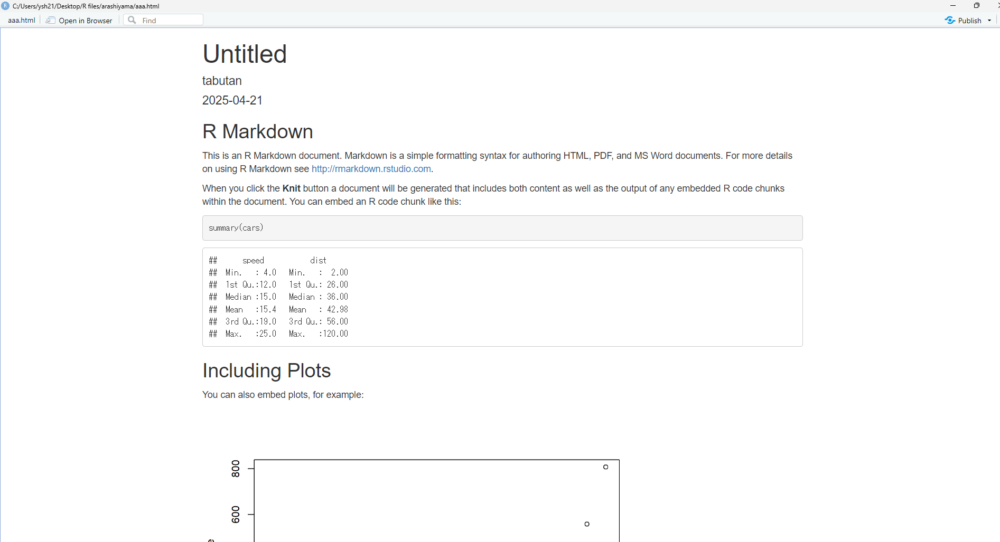
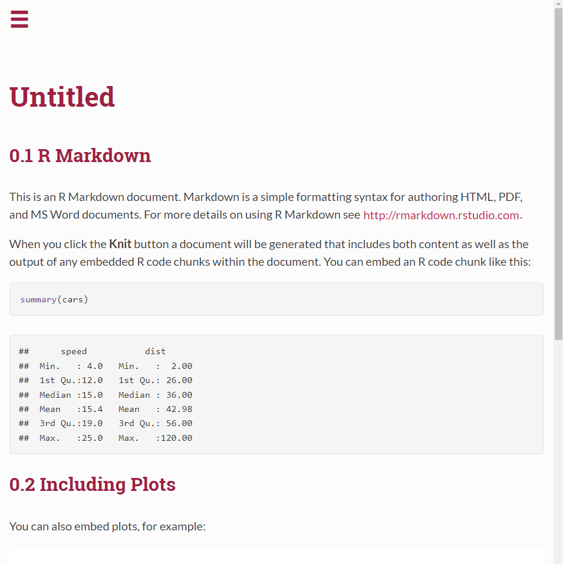
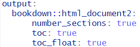
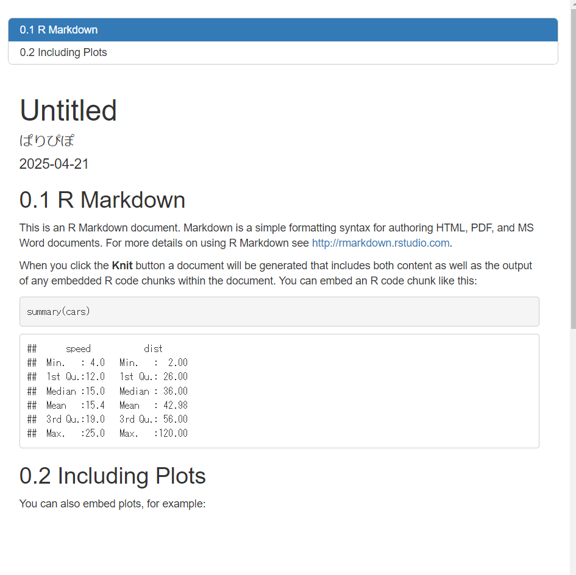

# 付録
## RMarkdownの見ため変更
### デフォルト
デフォルトのRmarkdownをKnitすると以下の図と同じものが再現されるはずである (図 \@ref(fig:default))。

```{r default, echo=FALSE, fig.cap="RMarkdownのデフォルト"}



```

GitBookは１つのプロジェクトで1つだけしか作成できず、GitBookがある状況で、別のRmarkdownをKnitできない。そのため、もし複数のRmarkdownをKnitしたい場合は、GitBookを消す必要がある。

### オプション１
index.Rmdの一番上にある各種設定のoutputを以下の図 \@ref(fig:redRMarkdown)と同じになるように注意深く書いてみよう。

```{r redRMarkdown, echo=FALSE, fig.cap="outputの入力：RMarkdownのオプション1", out.width="50%"}

knitr::include_graphics("image/RedRMarkdown.png")

```

そうすると、デフォルトのRmarkdownが次のような見た目にKnitできるはずだ（図 \@ref(fig:readthedown))。

```{r readthedown, echo=FALSE, fig.cap="RMarkdownのオプション1", out.width="50%"}



```

見た目がかっこいい。PDFに直さない限りこれで大丈夫。PDFに変換しようとすると見た目が汚くなる。うまくやれる方法があるかもしれないが、わからない（泣）

### オプション２
そこでシンプルな見た目だが、PDFでも見やすいRMarkdownを紹介する。
outputを図 \@ref(fig:simple)のように変更してみよう。

```{r simple, echo=FALSE, fig.cap="outputの入力：RMarkdownのオプション2", out.width="50%"}



```

そうすると、以下の図 \@ref(fig:option2)と同じRMarkdownができる。

```{r option2, echo=FALSE, fig.cap="outputの入力：RMarkdownのオプション2", out.width="50%"}



```

これは安心してPDFにできる。通学中心置きなく、PCを開かなくてもiPadにPDFを入れてオフライン状況下でも見返せる。レビューとデータ解析を別々のRMarkdownで出力することもできる。
RMarkdownのオプションは本当に多いが、これが今のところ知っている中で、シンプルかつ便利なものである。
