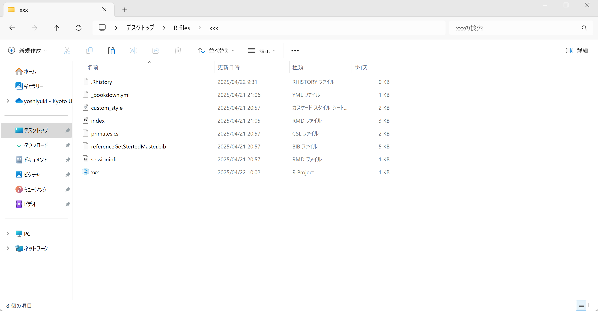

# トレーニング
## デスクトップにフォルダーを作る
マイクロソフトなどのクラウドと同期されていると、Rの挙動に予期せぬバグが生じることがある。まずは同期されていないことを確認し、されている場合は、切断しよう。

Desktopに新しく「R files」フォルダーを作成し、その後R Studioを立ち上げる。

## RでProjectを立ち上げる
右上にあるProject:(None)をクリックし、一番上のNew Projectをクリック、<br>
New Directory > New Project<br>
と進み、Directory nameにすきな名前をつける。日本語にするとバグが起こることがあるので、アルファベットが無難。

Create project as subdirectory of: のところに
「C:/Users/〇〇〇/Desktop/R files」と表示されればOK（〇〇〇はPCの名前であり、人それぞれ）。<br>
されていない場合は、BrowseボタンからR filesを指定する。


## Bookdownの再現 
### 練習ファイルのダウンロード
GitHubにある[修士のススメ](https://github.com/tabutan/GetStartedMaster.git)にある「練習用ファイル一覧」フォルダーをダウンロード。

R Projectと同じレイヤーにファイルを置く。図 \@ref(fig:downroad)のようになっていたらOK。
「xxx」はプロジェクト名なので、人それぞれ命名したものになる。

```{r downroad, echo=FALSE, fig.cap="ダウンロードしたファイルの置き場はR Projectと同じレイヤーにする", out.width="80%"}



```


Knitしてみると、本サイトの「0 はじめに」と同じものが表示されるはずである。
ここで表示されている内容は「[ヤクシマザルという生き物を知りたい](https://tabutan.github.io/yakuzaru/)」にあるものと同じものです。

### 言語設定をUTF-８にする
言語設定によっては日本語がバグの原因となり、日本語の部分が後で何を書いたのかわからなくなる。 必ずUTF-8にすること。UTF-8で指定しないとコードの日本語がすべて文字化けしてしまう(T_T)<br>
設定方法は、一番上にFile Edit View・・・と並んでいるところのToolsを選択し、

Tools > Global Options > Code > Saving

と進み、真ん中にあるDefault text encoddingでUTF-8を指定。

Applyをクリックし、OKをクリックして閉じる。

### Build Bookしてみよう
一応KnitでもHTMLが出現したと思うが、GitBookの場合はエラーの元（例えば、ある章を閲覧できないなど）。Q & AにあるGitBookの立ち上げ方を読み、Build Bookしてみよう。


## 新しいRmarkdownファイルを作成
左上にある緑の背景に白の十字のアイコンをクリック、Rmarkdownを選択。<br>
すべてデフォルトのままOKをクリック。

新しく作ったRmarkdownファイルをセーブして、名前を付ける。
その後、一旦そのファイル内の記述をすべて削除して、何か好きなことを書いてみる。
その後、_bookdown.ymlを開き、その中に「rmd_files:」が以下のようになっているはず。

>rmd_files:                    
  &nbsp;&nbsp;&nbsp;&nbsp;- index.Rmd<br>
  &nbsp;&nbsp;&nbsp;&nbsp;- sessioninfo.Rmd<br>
  
このリストの中に自分で作ったRmarkdownファイルの名前を入れよう。

>rmd_files:                
  &nbsp;&nbsp;&nbsp;&nbsp;- index.Rmd<br>
  &nbsp;&nbsp;&nbsp;&nbsp;- xyzw.Rmd<br>
  &nbsp;&nbsp;&nbsp;&nbsp;- sessioninfo.Rmd<br>
  
Build Bookすると自分のRmarkdownの内容が反映されているはず。

## 章立てをする
\#の数だけ階層を変えられる。#の後に半角スペースを入れることを忘れずに。

> \# 章<br>
> \#\# 節<br>
> \#\#\# 項<br>
> \#\#\#\# 次<br>


### わっしょい
#### ほいさほいさ


## 文章を書く
文章を書く際に、ワードのようにできない。Markdownの記法で表現する必要がある。ここではよく使うものを練習してみよう。

### 太字、イタリック
文章はそのまま書けばOK。

太字は、太字にしたい部分を\_\_または\*\*で囲めばOK。

> \*\*ぽよよん\*\*

>\_\_ぽよよん\_\_

**ぽよよん** <br>
__ぽよよん__

イタリックは\_または\*で囲む。

> \*italic\*、\_italic\_、\*字体によってイタリックに見えないものあり！\*<br>
霊長類の雑誌は、<br>
\*Primates\*<br>
\*International Journal of Primatology\*<br>
\*American Journal of Primatology\*<br>
\*Folia Primatologica\*<br>
の４つ。

*italic*、_italic_、*字体によってイタリックに見えないものあり！*

霊長類の雑誌は、<br>
*Primates*<br>
*International Journal of Primatology*<br>
*American Journal of Primatology*<br>
*Folia Primatologica*<br>
の４つ。

### 箇条書き
半角でマイナス記号、半角スペース　<br>
箇条書きの中の箇条書き：tabキー押して、半角でマイナス記号、半角スペース

> \- 箇条書き<br>
  \- 修士向け<br>
  \- 知らなくても大丈夫<br>
  \- のんびりできないし<br>
  \- すんなりいかない<br>
  \- スケジュール<br>
  \- 目指せRマスター<br>

- 箇条書き
  - 修士向け
  - 知らなくても大丈夫
  - のんびりできないし
  - すんなりいかない
  - スケジュール
  - 目指せRマスター


数字でもできる。

> \- 箇条書き<br>
  1. 修士向け<br>
  1. 知らなくても大丈夫<br>
  1. のんびりできないし<br>
  1. すんなりいかない<br>
  1. スケジュール<br>
  1. 目指せRマスター<br>

- 箇条書き
  1. 修士向け
  1. 知らなくても大丈夫
  1. のんびりできないし
  1. すんなりいかない
  1. スケジュール
  1. 目指せRマスター
  
### 数式
文章中の数式は\$で囲む。

> 個体追跡法でアカンボウを行動観察した（\$N=12\$、\$n=225\$）。

個体追跡法でアカンボウを行動観察した（$N=12$、$n=225$）。

#### 下付き文字、上付き文字
\$で囲んで、下付きにしたい文字をアンダーバーと{}で括る。1文字なら{}は省略可。上付き文字はアンダーバーの代わりに^を使う。

> \$N_a\$、\$N^a\$、\$N_{修士のススメ参加者}=7\$

$N_a$、$N^a$、$N_{修士のススメ参加者}=7$

### コメントアウト
隠したい文章は、「\<!\-\- 〇〇 \-\->」でコメントアウトできる。<br>
ショートカットキーは、「ctrl + shift + C」。

> \<!-- 見られたくない、見られたくない \-->、無事消えたかな？

<!-- 見られたくない、見られたくない -->、無事消えたかな？

### 引用文献
>ヤクシマザルは他地域のニホンザルより体毛が黒い [\@hamada1992]<br>
>\@hamada1992 はヤクシマザルは他地域のニホンザルより体毛が黒いことを明らかにした。 

ヤクシマザルは他地域のニホンザルより体毛が黒い [@hamada1992]<br>
@hamada1992 はヤクシマザルは他地域のニホンザルより体毛が黒いことを明らかにした。

> ニホンザルの研究はいろいろある [\@hamada1992; \@hikida2022]

ニホンザルの研究はいろいろある [@hamada1992; @hikida2022]

おっと、Hikida 2022の引用文献に問題発生。
Japanese macaquesにすべきところをjapanese macaquesと表示されているし、種名がイタリックになっていない！

**対処法**

bibファイルの中でHikida 2022に該当する箇所を探す。

>\@article{hikida2022,<br>
author = {Hikida, K.},<br>
title = {Eyeblink rate as an indicator of concentration on grooming in Japanese macaques (Macaca fuscata)},<br>
journal = {American Journal of Primatology},<br>
volume = {84},<br>
number = {7},<br>
pages = {e23392},

title = {xxxxxxx}になっているところをtitle ={{xxxxx}}に変更してみよう。小文字が正しく大文字に変更されているはず。

次に、イタリック。

イタリックにしたい箇所であるMacaca fuscataを\\textit{Macaca fuscata}というように書いてみよう。種名がイタリックになっているはず。
HP上は￥のマークになっているが、Ｒコード上はバックスラッシュであることに注意。


## Rコードを書く

「ctrl + alt + I」のショートカットキーを使うと、Rコードを入力するための灰色の領域が表示される。<br>
Rに内蔵されているmpgデータを使って図示できただろうか（図 \@ref(fig:mpg)）。

```{r mpg, fig.cap="mpgデータの図示"}
# パッケージの読み込み
library(tidyverse)

# 図示
## Rに内蔵されているmpgデータを使って図示
ggplot(data = mpg, aes(x = displ, y = hwy)) +
    geom_point()
```

